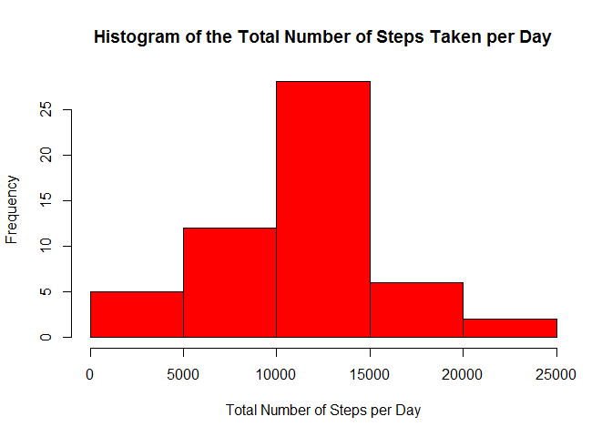
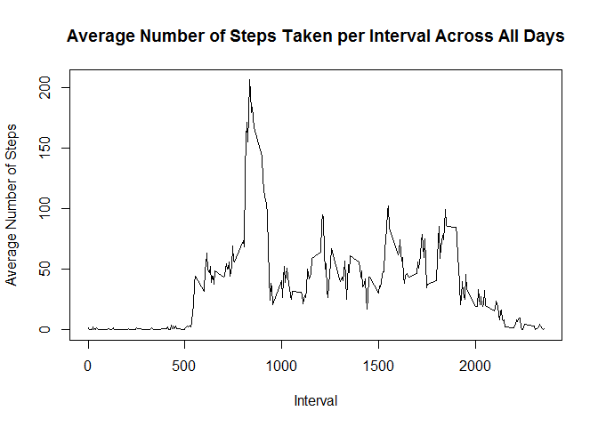
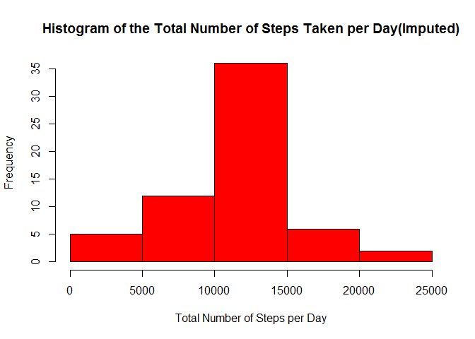

# Reproducible Research: Peer Assessment 1
## Introduction

This is the 1st Peer Assessment Report for the Data Science Specialisation Course on Reproducible Research.

## Loading and preprocessing the data

This is the initial code used to load and preprosses the data as well as load the required packages and change the number format of the inline outputs.


```r
#load packages used for the assignment
library(dplyr)
library(lattice)
#read and format data file
df<-read.csv(unz("activity.zip","activity.csv"))
df$date<-as.Date(df$date)
#make changes in number  format
## numbers >= 10^5 will be denoted in scientific notation and rounded to 2 digits
options(scipen = 1, digits = 2)
```

## What is mean total number of steps taken per day?

1.Code for the calculation of the daily steps and the creation of the histogram.


```r
#remove NA values by omitting them from the dataset used for the initial calculations
df1<-na.omit(df)
#find total steps per day using dplyr
dt1<-as.tbl(df1)
by_day<-group_by(dt1,date)
dailysum<-summarise(by_day,Steps.sum=sum(steps))
#create the histogram
hist(dailysum$Steps.sum,main="Histogram of the Total Number of Steps Taken per Day",col="red",border="black",xlab="Total Number of Steps per Day")
```

 

2.Code for the calculation of the overall the mean and median.


```r
#find daily mean
dailymean<-mean(dailysum$Steps.sum)
#find daily median
dailymedian<-median(dailysum$Steps.sum)
```

The *mean* is 10766.19 and the *median* is 10765.

## What is the average daily activity pattern?

1.Code for the calculation of the average steps taken by interval and its plot.


```r
#find average steps per interval using dplyr
by_interval<-group_by(dt1,interval)
interval_avg<-summarise(by_interval,Int.Avg=mean(steps))
#create plot of average steps per 5' interval
plot(interval_avg$interval,interval_avg$Int.Avg,type="l",ylab="Average Number of Steps",xlab="Interval",main="Average Number of Steps Taken per Interval Across All Days")
```

 

2.Code for finding the interval with the maximum number of steps on average


```r
#find max steps and interval pair
maxinterval<-filter(interval_avg,Int.Avg==max(Int.Avg))
```

The maximum number of steps on average are 206.17 and are found on the 835.

## Imputing missing values

1.Calculate and report the total number of missing values in the dataset (i.e. the total number of rows with NAs).


```r
#count NA
Count.NA<-sum(is.na(df$steps))
```

2.Devise a strategy for filling in all of the missing values in the dataset. The strategy does not need to be sophisticated. For example, you could use the mean/median for that day, or the mean for that 5-minute interval, etc.

Strategy of replacing missing values with **5' interval average** chosen. **Looping** through the rows and replacing the NA values using the *dplyr* package.

3. Use strategy of step 2 to create a new dataset equal to the original but with no missing values.


```r
dt2<-as.tbl(df)
#replace NA values with 5' interval average
for(i in 1:nrow(dt2)){
  if(is.na(dt2$steps[i])){
    intervalid<-filter(interval_avg,interval==dt2$interval[i])
    dt2$steps[i]<-intervalid$Int.Avg
  }
}
```

4. Create updated histogram with the new dataset


```r
#find new daily sums with dplyr
by_day_2<-group_by(dt2,date)
dailysum_2<-summarise(by_day_2,Steps.sum=sum(steps))
#create updated histogram
hist(dailysum_2$Steps.sum,main="Histogram of the Total Number of Steps Taken per Day(Imputed)",col="red",border="black",xlab="Total Number of Steps per Day")
```

 

Report new mean and median and comment on the results.


```r
dailymean_2<-mean(dailysum_2$Steps.sum)
dailymedian_2<-median(dailysum_2$Steps.sum)
```

The second dataset's daily step mean is 10766.19 and the daily step median is 10766.19. The daily step median is the same as in Part 1 (initial dataset), while the daily step mean of the second dataset has become equal with the daily step median of the two datasets.

## Are there differences in activity patterns between weekdays and weekends?

For this part the weekdays() function may be of some help here. Use the dataset with the filled-in missing values for this part.

1.Create a new factor variable in the dataset with two levels -- "weekday" and "weekend" indicating whether a given date is a weekday or weekend day.


```r
#Use weekdays() to find the day of the week for each date
dt2$dayofweek<-weekdays(dt2$date)
#Use dplyr to create the new column with the weekday or weekend factor
dt3<-mutate(dt2,daycategory=ifelse(dt2$dayofweek=="Saturday"|dt2$dayofweek=="Sunday","Weekend","Weekday"))
dt3$daycategory=factor(dt3$daycategory)
```

2.Make a panel plot containing a time series plot (i.e. type = "l") of the 5-minute interval (x-axis) and the average number of steps taken, averaged across all weekday days or weekend days (y-axis). The plot should look something like the following, which was created using simulated data:


```r
#Sum the total steps for each day for each day category (weekday/end)
dailysum_3<-aggregate(steps~interval+daycategory,data=dt3,mean)
#Plot the results using the lattice package
xyplot(steps~interval|daycategory,dailysum_3,type="l",layout=c(1,2),xlab="Interval",ylab="Number of Steps")
```

 

End of Peer Assignment 1. Thank you for your time and good luck with your results :) 
